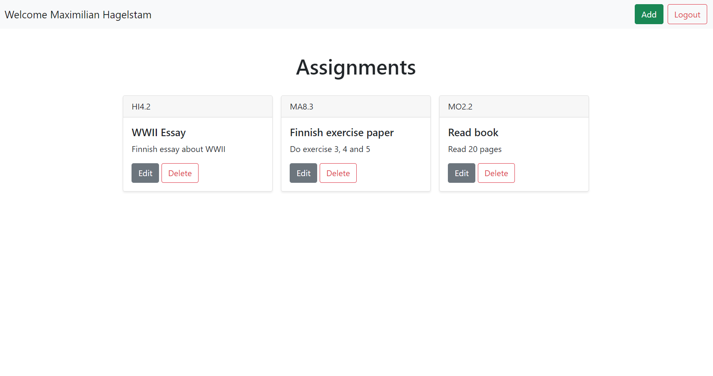

# Dohi

<a href="https://dohi.netlify.app">
    
</a>

Homework tracker

## Prerequisites

- Node.js 12<
- PostgreSQL
- Yarn
- Google OAuth secrets

## Getting Started

```
# clone repo
git clone https://github.com/MaximilianHagelstam/dohi.git

# move into project
cd dohi
```

```
# Server

# move into folder
cd server

# create .env
cp .env.example .env

# install dependencies
yarn install

# run local postgres instance
yarn start-db

# build typescript
yarn build

# run server in development
yarn dev
```

```
# Client

# move into folder
cd client

# create .env
cp .env.example .env

# install dependencies
yarn install

# run app
yarn start
```

## Technologies

- Express.js
- TypeScript
- PostgreSQL
- TypeORM
- Passport.js
- React.js
- react-bootstrap

## License

This project is licensed under the terms of the [MIT](https://choosealicense.com/licenses/mit/) license.
